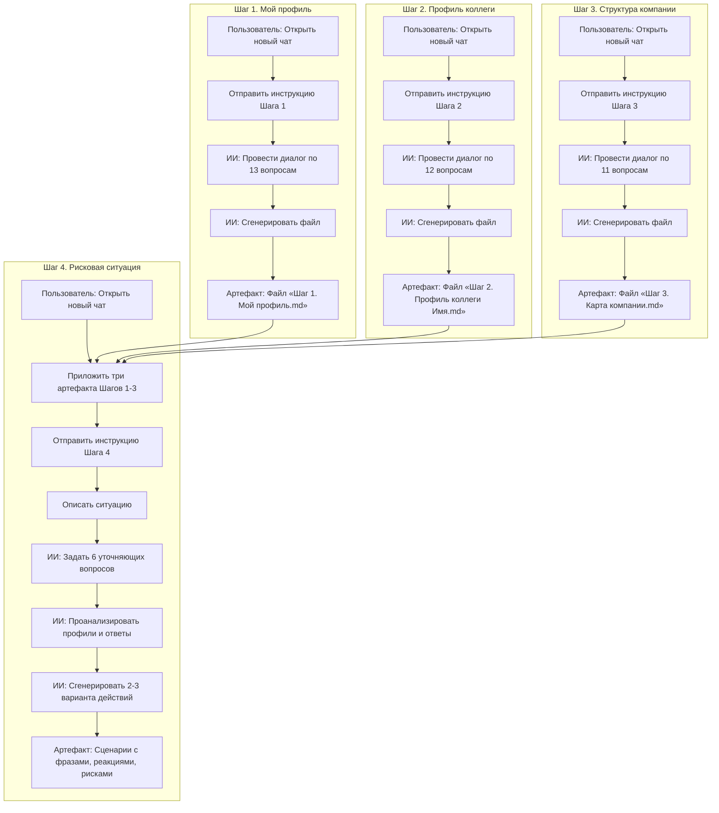
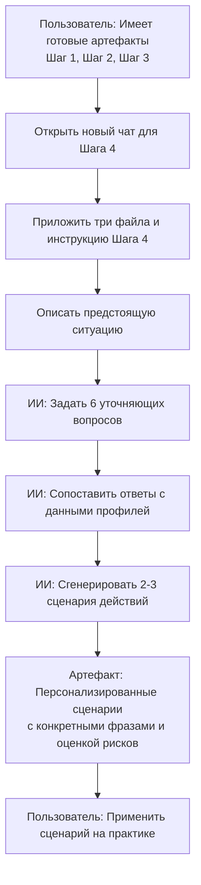
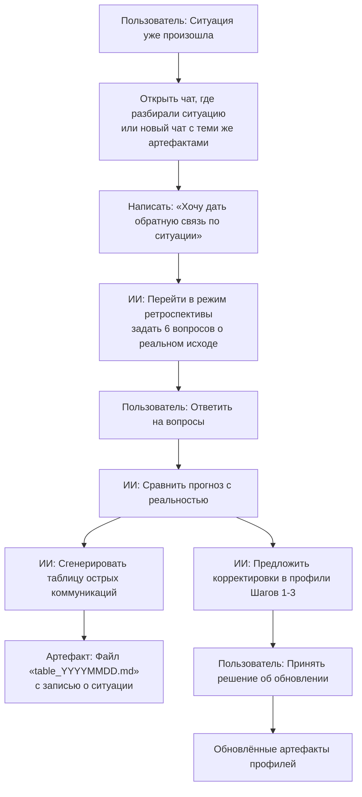
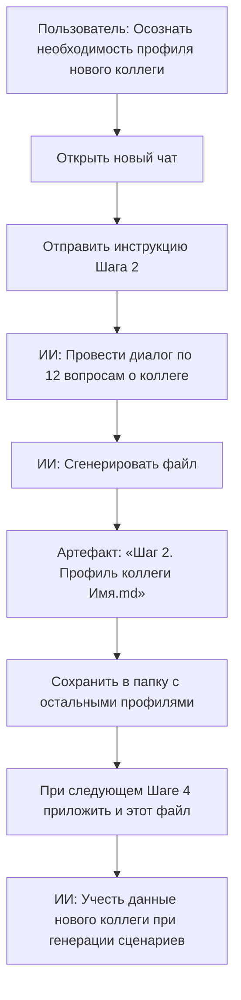
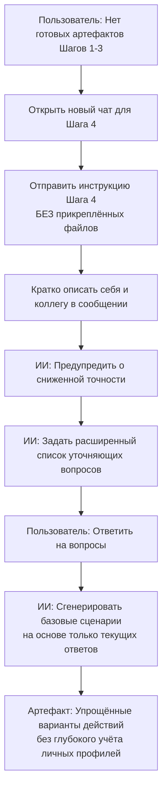

# Клиентские пути фреймворка проектирования коммуникаций

Ниже описаны ключевые сценарии использования системы. Каждый путь иллюстрирует последовательность действий пользователя при взаимодействии с ИИ‑чатами.

---

# Путь 1. Первичное прохождение (с нуля)

**Описание:**  
Пользователь впервые знакомится с системой. Он последовательно проходит все четыре шага в отдельных чатах. На Шагах 1–3 ИИ проводит интервью и формирует профильные файлы. На Шаге 4 пользователь собирает полученные файлы, добавляет инструкцию и вместе с ИИ разбирает реальную или гипотетическую сложную ситуацию. Результат — готовые сценарии поведения с конкретными формулировками.

---

# Путь 2. Подготовка к конкретной ситуации (профили уже есть)

**Описание:**  
Пользователь уже заполнил базовые профили (возможно, несколько месяцев назад). Теперь ему нужно подготовиться к важной встрече или разговору. Он открывает новый чат, загружает готовые файлы и инструкцию Шага 4. ИИ анализирует профили и в диалоге уточняет детали предстоящей ситуации. На выходе — персонализированные варианты действий, учитывающие триггеры пользователя, мотивы оппонента и контекст компании.

---

# Путь 3. Ретроспектива после реального события

**Описание:**  
Разговор состоялся, и реальность могла отличаться от прогнозов. Пользователь возвращается в чат Шага 4 (или создаёт новый с теми же файлами) и инициирует режим ретроспективы. ИИ задаёт вопросы о том, что сработало, а что нет, и какие новые инсайты появились о себе или коллеге. На основе ответов формируется **таблица острых коммуникаций** и предлагаются корректировки в профильные файлы. Это делает систему самообучающейся и повышает точность будущих разборов.

---

# Путь 4. Периодическая актуализация профилей (ревизия)

```mermaid
flowchart TD
    subgraph Ревизия_себя
        A1[Артефакт: «Шаг 1. Мой профиль.md»] --> A2[Пользователь: Проверить актуальность]
        A2 --> A3{Изменения есть?}
        A3 -->|Да| A4[Открыть новый чат с инструкцией Шага 1]
        A4 --> A5[ИИ: Провести диалог заново]
        A5 --> A6[Артефакт: Обновлённый «Шаг 1. Мой профиль.md»]
        A3 -->|Нет| A7[Оставить без изменений]
    end

    subgraph Ревизия_коллег
        B1[Артефакты: «Шаг 2. Профиль коллеги Имя.md»] --> B2[Пользователь: Оценить актуальность гипотез]
        B2 --> B3{Нужно обновить?}
        B3 -->|Да| B4[Открыть новый чат с инструкцией Шага 2]
        B4 --> B5[ИИ: Провести диалог заново]
        B5 --> B6[Артефакт: Обновлённый профиль коллеги]
        B3 -->|Нет| B7[Оставить как есть]
    end

    subgraph Ревизия_компании
        C1[Артефакт: «Шаг 3. Карта компании.md»] --> C2[Пользователь: Проверить изменения в структуре]
        C2 --> C3{Требуется обновление?}
        C3 -->|Да| C4[Открыть новый чат с инструкцией Шага 3]
        C4 --> C5[ИИ: Провести диалог заново]
        C5 --> C6[Артефакт: Обновлённая карта компании]
        C3 -->|Нет| C7[Оставить без изменений]
    end
```

**Описание:**  
Со временем люди меняются, появляются новые обстоятельства. Рекомендуется раз в 1–3 месяца пересматривать профили. Пользователь открывает сохранённые markdown‑файлы и самостоятельно проверяет, всё ли ещё верно. Если обнаружены расхождения — он повторяет соответствующий шаг в новом чате, получая обновлённый файл. Это поддерживает систему в актуальном состоянии и гарантирует качество сценариев на Шаге 4.

---

# Путь 5. Добавление нового коллеги в систему

**Описание:**  
В рабочем окружении появляется новый значимый коллега (руководитель, смежник, подрядчик). Пользователь хочет подготовиться к взаимодействию с ним. Он проходит Шаг 2 в отдельном чате, создавая профиль этого человека. Новый файл добавляется в «библиотеку» и используется в будущих разборах Шага 4 наравне с остальными. Путь может повторяться для неограниченного числа коллег.

---

# Путь 6. Экспресс-разбор без полных профилей (упрощённый)

**Описание:**  
Экстренный случай: нужно подготовиться к разговору, а профилей нет, и времени проходить Шаги 1–3 нет. Пользователь открывает чат Шага 4, прикладывает инструкцию, но вместо файлов даёт краткое устное описание себя и оппонента. ИИ предупреждает, что точность будет ниже, задаёт больше уточняющих вопросов и выдаёт упрощённые сценарии. Этот путь не рекомендуется для регулярного использования, но может выручить в критической ситуации.

---

# Путь 7. Командное использование (для тимлида / фасилитатора)

```mermaid
flowchart TD
    subgraph Сбор_артефактов
        A1[Тимлид: Провести сессию с командой] --> A2[Собрать ответы участников]
        A2 --> A3[Для каждого участника пройти Шаг 1 в чате]
        A3 --> A4[Артефакты: Файлы «Шаг 1. Мой профиль Участник N.md»]
        A4 --> A5[Для ключевых стейкхолдеров пройти Шаг 2]
        A5 --> A6[Артефакты: Файлы «Шаг 2. Профиль стейкхолдера X.md»]
        A6 --> A7[Пройти Шаг 3 для общей картины компании]
        A7 --> A8[Артефакт: «Шаг 3. Карта компании.md»]
    end

    subgraph Использование_в_команде
        B1[Тимлид: Для конкретной встречи выбрать релевантные профили] --> B2[Открыть новый чат Шага 4]
        B2 --> B3[Приложить выбранные артефакты + инструкцию Шага 4]
        B3 --> B4[Описать ситуацию от лица команды]
        B4 --> B5[ИИ: Задать уточняющие вопросы]
        B5 --> B6[ИИ: Сгенерировать сценарии,<br/>учитывающие динамику нескольких участников]
        B6 --> B7[Артефакт: Рекомендации для команды<br/>с распределением ролей и фразами]
        B7 --> B8[Тимлид: Распространить сценарии внутри команды]
    end
```

**Описание:**  
Тимлид или фасилитатор использует фреймворк для улучшения коммуникаций всей команды. Он помогает коллегам пройти Шаг 1 (или заполняет профили на основе наблюдений), создаёт профили ключевых внешних фигур и общую карту компании. Затем для каждой важной встречи (например, переговоры с другим отделом) запускает Шаг 4, загружая нужные файлы. Полученные сценарии и фразы могут быть использованы всей командой для синхронизации действий и снижения конфликтности.